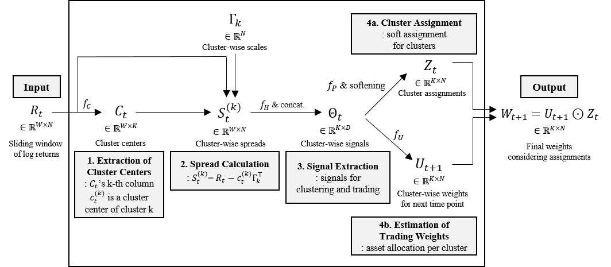

# An End-to-End Deep Learning Model for Clustering-Based Statistical Arbitrage

Official implementation of the paper *"An End-to-End Deep Learning Model for Clustering-Based Statistical Arbitrage"*.

This repository contains the complete implementation of an end-to-end deep learning framework for clustering-based statistical arbitrage in cryptocurrency futures markets. The model integrates asset clustering, spread modeling, and portfolio optimization within a unified, profit-aware training objective.

Key features:
- Transformer-based cluster center extraction
- Volatility-aware spread construction
- Differentiable cluster assignment
- Market-neutral portfolio optimization
- Walk-forward cross-validation framework

---

Scripts:
 - modules.py: scripts for data preprocessing, model, and performance measurements
 - main.py: scripts for training and testing

---

Framework:

  

---

The 4-hour interval Binance Futures cryptocurrency data used in the paper’s experiments can be found at: https://dx.doi.org/10.21227/bt01-qf94
